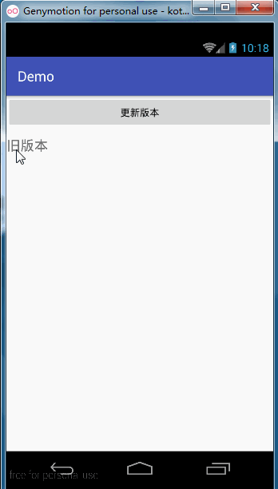
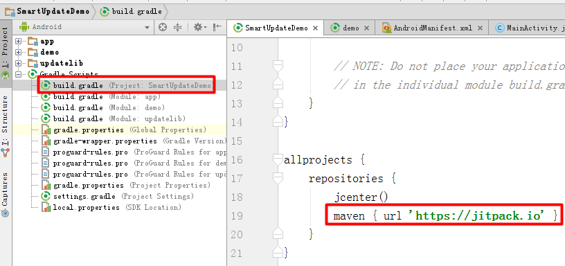
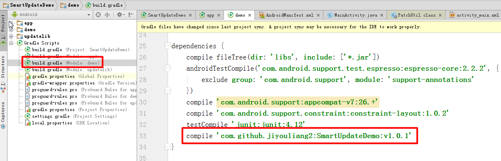

# 增量更新SmartUpdateDemo
---
开源地址：[https://github.com/jiyouliang2/SmartUpdateDemo/](https://github.com/jiyouliang2/SmartUpdateDemo/ "https://github.com/jiyouliang2/SmartUpdateDemo/")

# 运行效果

* 爱生活,爱学习,更爱做代码的搬运工,分类查找更方便请下载黑马助手app

## 使用步骤

### 1. 在project的build.gradle添加如下代码(如下图)

	allprojects {
	    repositories {
	        maven { url "https://jitpack.io" }
	    }
	}

	

	
### 2. 在Module的build.gradle添加依赖（如下图）

    compile 'com.github.jiyouliang2:SmartUpdateDemo:1.0.1'

### 3.添加权限

	 <uses-permission android:name="android.permission.READ_EXTERNAL_STORAGE" />
	 <uses-permission android:name="android.permission.WRITE_EXTERNAL_STORAGE" />

### 4.代码中使用

	 PatchUtil.patch(旧版本, 新版本, 差分包);
    
* 详细的使用方法在DEMO里面都演示啦,如果你觉得这个库还不错,请赏我一颗star吧~~~

* 欢迎关注微信公众号

    
